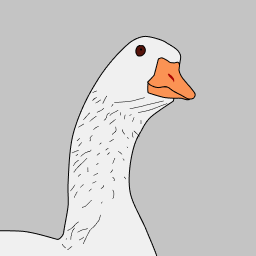

# goose_ui
an elegant uikit for flutter desktop. 

## Getting Started

### run gallery 

```shell
cd gallery
flutter run
```

* generate gallery code
> using codeviewer_cli
```dart
dart run tool/codeviewer_cli/main.dart
```

### development

```dart
melos bs
```

## Current Widgets

* [x] AppBar
* [x] AppMenu
* [x] AppTitleBar
* [x] Button
* [x] Calendar
* [x] Card
* [x] Checkbox
* [x] Drawer
* [x] Expansion
* [x] Input
* [x] Loading
* [x] Menu
* [x] Pagination
* [x] Radio
* [x] Rating
* [x] Scaffold
* [x] Select
* [x] Switch
* [x] SystemBar

## RoadMap

### goose_ui road map

* [0.1](https://github.com/goose-kit/goose_ui/projects/1) widgets develop
* [0.2](https://github.com/goose-kit/goose_ui/projects/2) theme  

### gallery road map

* [ ] use Navigator 2

## Thanks 

* [flutter_distributor](https://github.com/leanflutter/flutter_distributor) A complete tool for packaging and publishing your Flutter apps.
* [melos](https://github.com/invertase/melos) A tool for managing Dart projects with multiple packages. 

## Contribution

<div style="display:flex;flex-wrap: wrap;gap: 8px">
    
    <!-- add more Contributor here -->
</div>

## License

* main project license is under [MIT](./LICENSE)
* [codeviewer_cli](./gallery/tool/codeviewer_cli) license is under [BSD 3](./gallery/tool/codeviewer_cli/LICENSE)


### Copyright Notice
the logo was published at [Pixabay](https://pixabay.com/zh/?utm_source=link-attribution&amp;utm_medium=referral&amp;utm_campaign=image&amp;utm_content=148806) by [OpenClipart-Vectors](https://pixabay.com/zh/users/openclipart-vectors-30363/?utm_source=link-attribution&amp;utm_medium=referral&amp;utm_campaign=image&amp;utm_content=148806)
